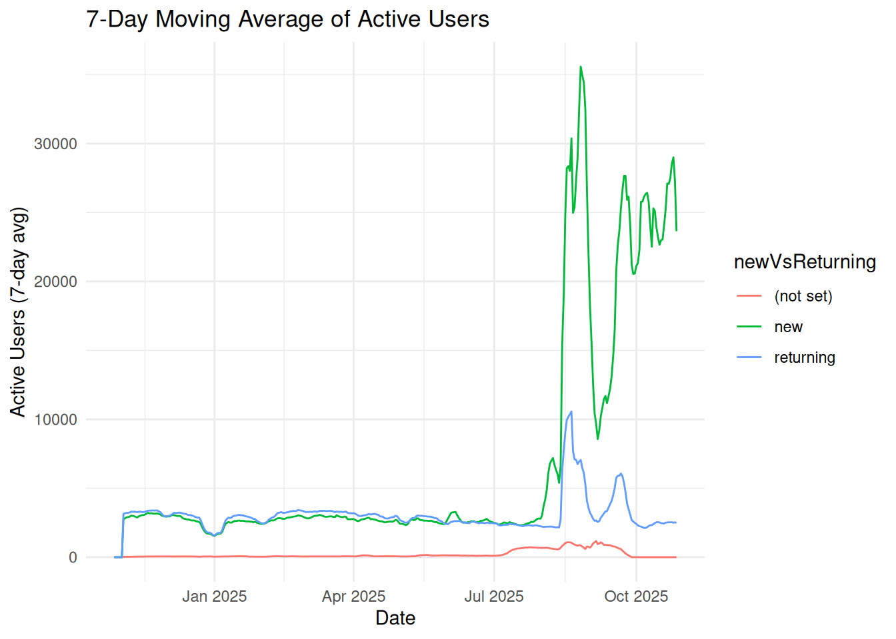

# Google Analytics

## What is Google Analytics?

Google Analytics is a web analytics service offered by Google that
tracks and reports website traffic. It is currently a platform in the
Google Marketing Platform brand. Google Analytics is the most widely
used web analytics service on the web. It is a powerful tool that
provides insights into how users interact with your website, allowing
you to make data-driven decisions to improve user experience and
optimize your marketing efforts. Google Analytics 4 (GA4) is the latest
version of Google Analytics, which focuses on event-based tracking and
provides more advanced features for analyzing user behavior across
different platforms.

## The `googleAnalyticsR` package

The `googleAnalyticsR` package is an R client for the Google Analytics
API. It allows you to access and analyze your Google Analytics data
directly from R, making it easier to integrate web analytics into your
data analysis workflow. The package provides functions to authenticate
with your Google account, retrieve data from Google Analytics, and
perform various analyses on the data.

## Getting started with `googleAnalyticsR`

``` r
library(googleAnalyticsR)
library(programets)
```

``` r
ga_auth(email = "seandavi@gmail.com")
```

    #> ℹ Authenticating using ga4-api-accessor@bioconductor-ga4-home.iam.gserviceaccount.com

``` r
account_list <- ga_account_list("ga4")

## account_list will have a column called "propertyId"
account_list$propertyId
#> [1] "388188354"

## View account_list and pick the one that you want to use
## In this case, we will use Bioconductor
ga_id <- 388188354
```

The resulting `res` object will contain the data for the specified date
range, metrics, and dimensions. You can view the first few rows of the
data using the [`head()`](https://rdrr.io/r/utils/head.html) function.

``` r
library(lubridate)
#> 
#> Attaching package: 'lubridate'
#> The following objects are masked from 'package:base':
#> 
#>     date, intersect, setdiff, union

start_date <- Sys.Date() - 365
end_date <- Sys.Date() - 1


daily_user_country_data <- ga_data(
    propertyId = ga_id,
    dimensions = c("date", "newVsReturning", "country"), # Added dimensions
    metrics = c("activeUsers", "sessions"), # Example metrics
    date_range = c(start_date, end_date),
    limit = -1
)
#> ℹ 2025-12-04 19:39:33.774667 > Downloaded [ 82277 ] of total [ 82277 ] rows
```

``` r
library(ggplot2)
library(zoo)
#> 
#> Attaching package: 'zoo'
#> The following objects are masked from 'package:base':
#> 
#>     as.Date, as.Date.numeric
library(dplyr)
#> 
#> Attaching package: 'dplyr'
#> The following objects are masked from 'package:stats':
#> 
#>     filter, lag
#> The following objects are masked from 'package:base':
#> 
#>     intersect, setdiff, setequal, union

# Group by user type and country, then calculate rolling average
moving_avg_data <- daily_user_country_data |>
    arrange(date) |>
    group_by(newVsReturning, country) |>
    mutate(
        activeUsers_7day_avg = rollmean(activeUsers, k = 7, fill = NA, align = "right"),
        sessions_7day_avg = rollmean(sessions, k = 7, fill = NA, align = "right")
    ) |>
    ungroup()

# Let's see the results
head(moving_avg_data)
#> # A tibble: 6 × 7
#>   date       newVsReturning country    activeUsers sessions activeUsers_7day_avg
#>   <date>     <chr>          <chr>            <dbl>    <dbl>                <dbl>
#> 1 2024-12-04 new            United St…        1083     1086                   NA
#> 2 2024-12-04 returning      United St…        1067     1500                   NA
#> 3 2024-12-04 returning      China              836     1214                   NA
#> 4 2024-12-04 new            China              680      682                   NA
#> 5 2024-12-04 returning      United Ki…         246      328                   NA
#> 6 2024-12-04 returning      Germany            213      314                   NA
#> # ℹ 1 more variable: sessions_7day_avg <dbl>

# Plot the moving average for active users
moving_avg_data |>
    group_by(date, newVsReturning) |>
    summarise(activeUsers_7day_avg = sum(activeUsers_7day_avg, na.rm = TRUE)) |>
    ggplot(aes(x = date, y = activeUsers_7day_avg, color = newVsReturning)) +
    geom_line() +
    labs(
        title = "7-Day Moving Average of Active Users",
        x = "Date",
        y = "Active Users (7-day avg)"
    ) +
    theme_minimal()
#> `summarise()` has grouped output by 'date'. You can override using the
#> `.groups` argument.
```


